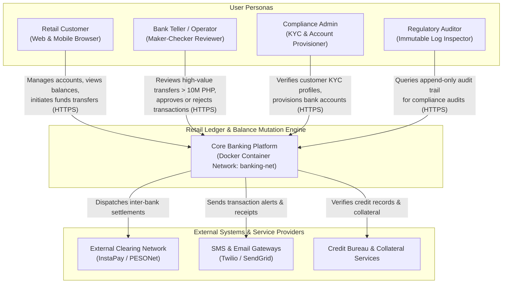
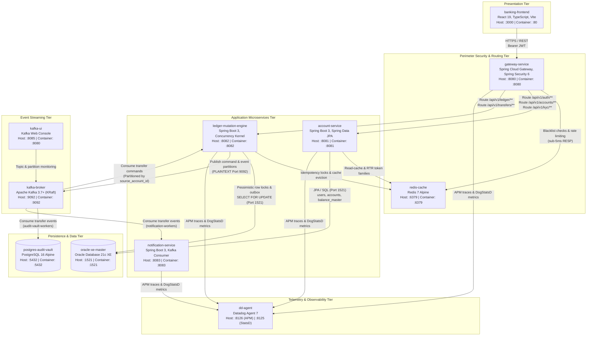
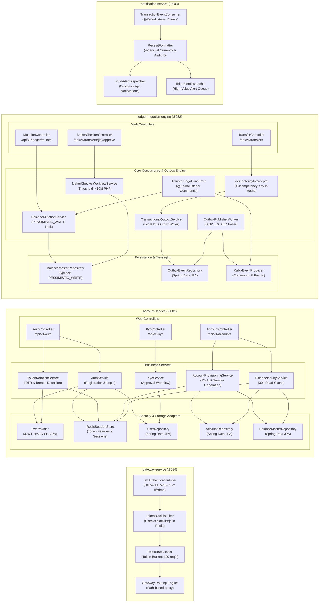
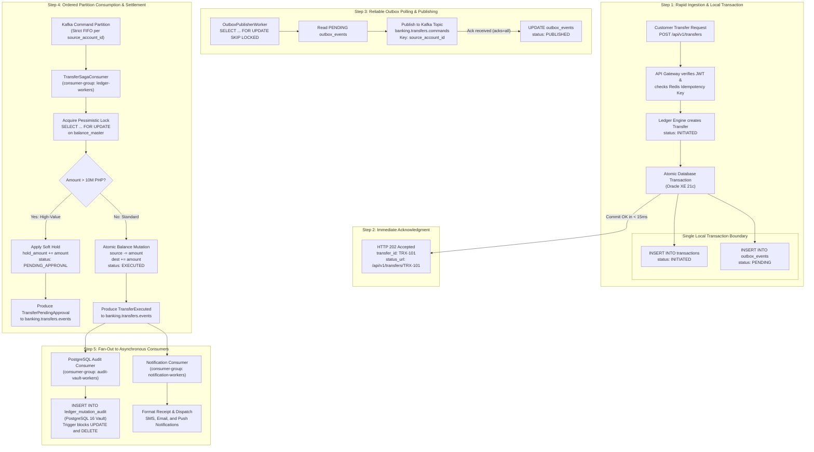
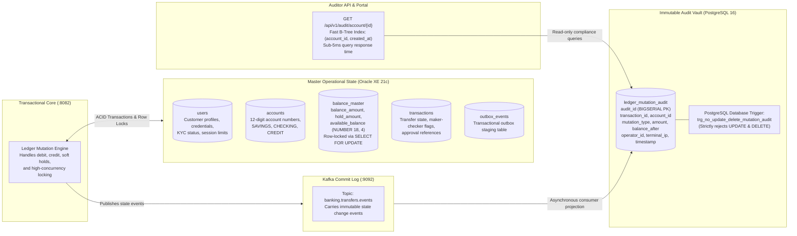
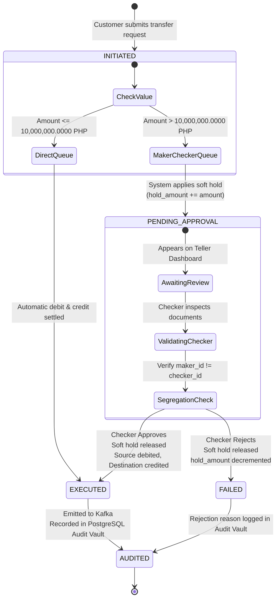
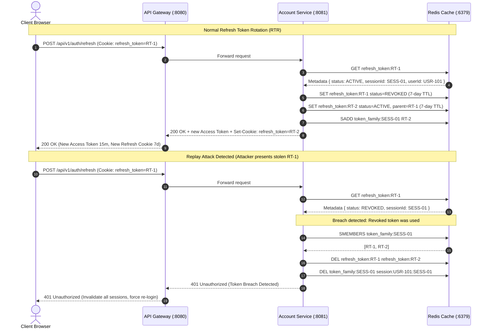

# Architecture Diagrams: Retail Ledger & Balance Mutation Engine

This document provides visual architectural models for the retail banking platform. It includes system context, container topology, component internals, dual-storage pipelines, and state machines.

---

## 1. System Context Diagram (C4 Level 1)

The system context diagram shows the core banking platform, user personas, and external third-party integration boundaries.

---

## 2. Container Topology & Networking Architecture (C4 Level 2)

All containers run inside the dedicated Docker Compose bridge network (`banking-net`). External browser traffic enters through host port mappings, while inter-service communication uses internal container DNS names.

---

## 3. Microservice Component Architecture (C4 Level 3)

This diagram details the internal modules, service boundaries, and adapters inside each microservice.

---

## 4. Dual-Storage & Transactional Outbox Pipeline

The Transactional Outbox pattern guarantees that database writes and message broker events never fall out of sync, even if network failures occur.

---

## 5. Dual-Storage Ledger vs Audit Vault Topology

This diagram illustrates the architectural separation between the live operational transactional state in Oracle XE and the append-only regulatory audit vault in PostgreSQL.

---

## 6. High-Value Maker-Checker State Transition Model

Transactions exceeding 10,000,000.0000 PHP require two distinct banking operators: the Maker who initiates the transaction, and the Checker who reviews and releases the funds.

---

## 7. Refresh Token Rotation (RTR) & Breach Detection Flow

The system protects against stolen refresh tokens by rotating tokens on each refresh call and revoking the entire token family if a retired token is presented.

---

## 8. Network Ports and Protocols Reference

| Container | Host Port | Internal Port | Protocol | Scope | Role |
| :--- | :---: | :---: | :--- | :--- | :--- |
| `banking-frontend` | `3000` | `80` | HTTP / Web | Public | React 19 Single Page Application |
| `gateway-service` | `8080` | `8080` | HTTP / REST | Public | Perimeter security, rate limiting, and routing |
| `account-service` | `8081` | `8081` | HTTP / REST | Internal | Customer onboarding, KYC, account provisioning |
| `ledger-mutation-engine` | `8082` | `8082` | HTTP / REST | Internal | Concurrency row locking, balance mutations, outbox |
| `notification-service` | `8083` | `8083` | HTTP / REST | Internal | Asynchronous alert dispatching and receipt generation |
| `redis-cache` | `6379` | `6379` | RESP / TCP | Internal | Token blacklists, idempotency locks, balance read-cache |
| `oracle-xe-master` | `1521` | `1521` | Oracle TNS | Internal | Primary transactional state and pessimistic locking |
| `postgres-audit-vault` | `5432` | `5432` | PostgreSQL | Internal | Append-only immutable regulatory audit vault |
| `kafka-broker` | `9092` | `9092` | PLAINTEXT | Internal | Event streaming commit log (KRaft mode) |
| `kafka-ui` | `8085` | `8080` | HTTP / Web | Host Browser | Kafka partition, message, and consumer management |
| `dd-agent` | `8126` / `8125` | `8126` / `8125` | APM / StatsD | Host / Internal | Enterprise Observability: APM traces, DogStatsD metrics, container logs |
| `jaeger-tracing` | `16686` / `4317` | `16686` / `4317` | HTTP / gRPC | Host Browser | OpenTelemetry distributed trace visualizer (:16686) & OTLP receiver |

