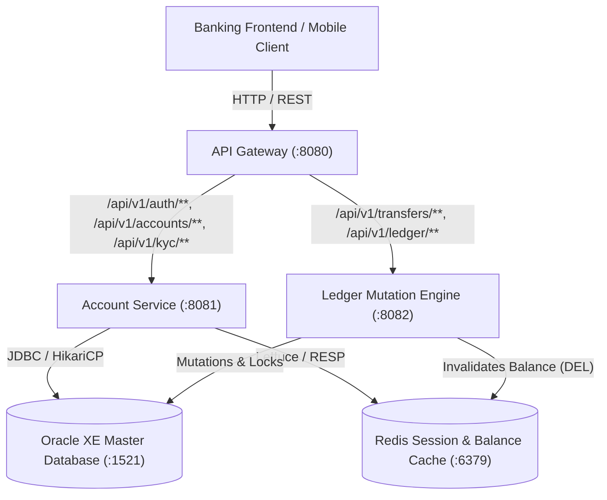
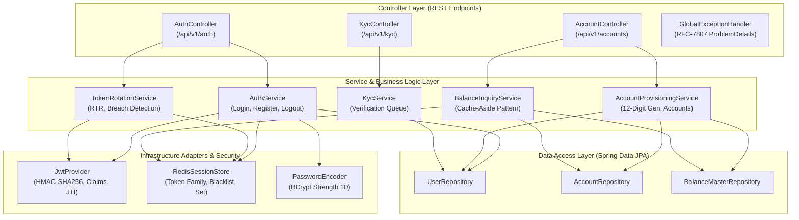
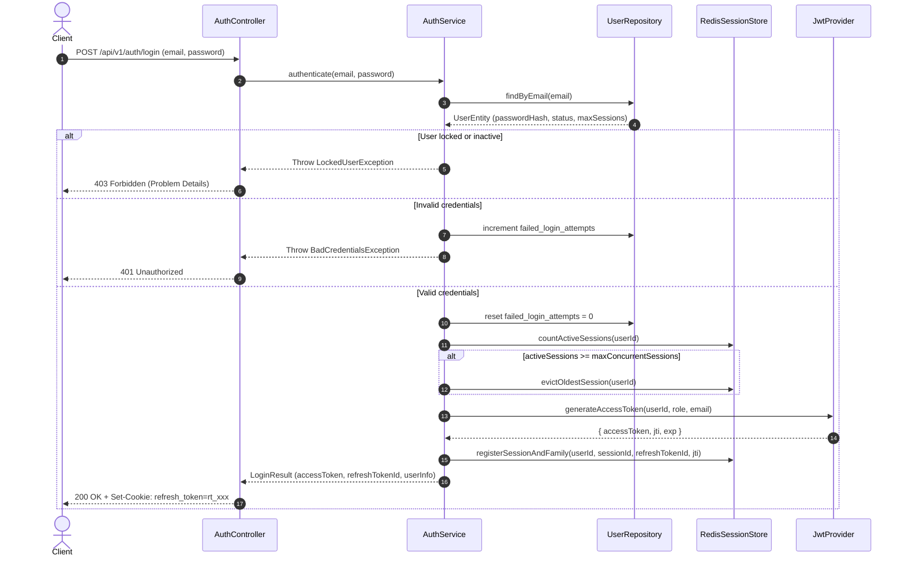
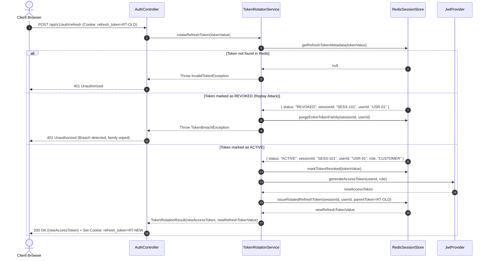
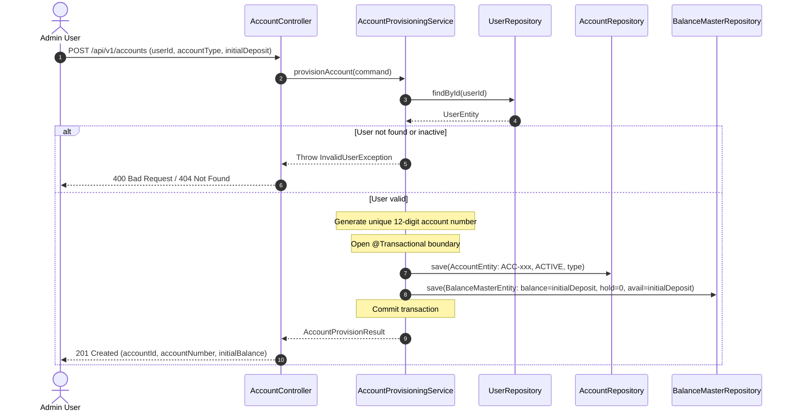
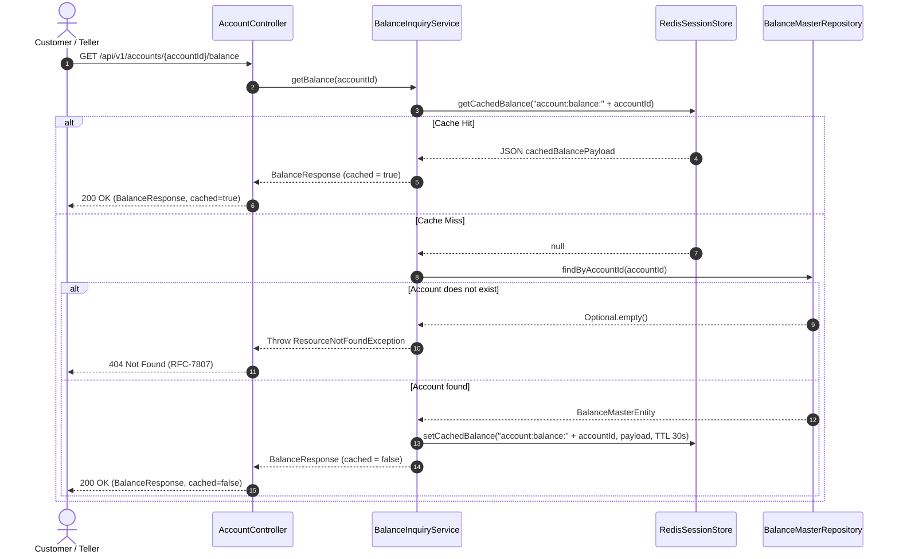

# Design Specification: Account & Identity Microservice (account-service)

## 1. System Architecture and Component Structure

The Account Service is a Spring Boot 3 microservice responsible for customer onboarding, authentication, session lifecycle, account provisioning, and balance inquiry. It sits alongside the API Gateway and Ledger Engine, connecting directly to the Oracle XE master database and Redis distributed cache.

### System Context Diagram

### Component Structure

## 2. Sequence Flows

### Authentication and Session Creation Flow

### Refresh Token Rotation and Breach Detection Flow

### Account Provisioning Flow

### Cached Balance Inquiry Flow

## 3. Technology Selection Matrix

| Architectural Layer | Selected Technology | Architectural Rationale |
| :--- | :--- | :--- |
| Framework & Runtime | Java 21 LTS, Spring Boot 3.3.4 | Consistent JVM baseline matching root Maven parent, virtual thread ready, modern security support. |
| Web & REST API | Spring Web MVC, Jakarta Validation | High throughput REST controller baseline with declarative JSR-380 validation. |
| Persistence & ORM | Spring Data JPA, Hibernate 6, HikariCP | Direct binding to Oracle XE master schema with pooled JDBC connection control. |
| Master Database | Oracle Database 21c (ojdbc11) | Canonical enterprise ledger holding users, accounts, and balance master with strict 4-decimal constraints. |
| Caching & Session | Redis 7, Lettuce Driver, Spring Data Redis | Sub-millisecond token blacklisting, token family sets for breach detection, and 30-second balance read-cache. |
| Cryptography & JWT | JJWT (io.jsonwebtoken:jjwt-api:0.12.6), BCrypt | Standard RFC-7519 HMAC-SHA256 signature handling and salted password hashing. |
| Error Representation | RFC-7807 Problem Details | Standardized error contracts across all banking microservices. |
| Automated Testing | JUnit 5, Mockito, H2 in-memory mode | Isolated unit and integration tests executing without live external infrastructure dependencies. |

## 4. Correctness Invariants and Formal Properties

1. Balance Precision Invariant:
   All financial fields (`balance_amount`, `hold_amount`, `available_balance`, `initial_deposit`) must maintain scale equal to 4 and precision up to 18 digits. Floating-point types are strictly forbidden.
   $$\text{scale}(balance) = 4, \quad 0 \le hold\_amount \le balance\_amount, \quad available\_balance = balance\_amount - hold\_amount$$

2. Account Number Invariant:
   Every generated account number must consist of exactly 12 numeric digits and be globally unique across all accounts.
   $$\text{length}(account\_number) = 12, \quad account\_number \in [0-9]^{12}$$

3. Token Family Invariant:
   For any login session $S$, there exists at most one refresh token with status `ACTIVE`. All predecessor tokens in the family have status `REVOKED`.
   $$|\{ t \in \text{Family}(S) \mid \text{status}(t) = \text{ACTIVE} \}| \le 1$$

4. Breach Detection Postcondition:
   If a token $t$ where $\text{status}(t) = \text{REVOKED}$ is submitted for refresh, all keys associated with $\text{Family}(\text{session}(t))$ must be deleted immediately from Redis.
   $$\forall k \in \text{Family}(S), \quad \text{Redis.exists}(k) = \text{false}$$

5. Concurrent Session Bound:
   For any user $U$, the number of active sessions tracked in Redis cannot exceed the user configured maximum.
   $$|\text{ActiveSessions}(U)| \le \text{max\_concurrent\_sessions}(U)$$

## 5. Traceability Matrix

| Requirement ID | Requirement Summary | Design Components Satisfying Requirement |
| :--- | :--- | :--- |
| REQ-1.1 to REQ-1.6 | Customer Registration & Validation | `AuthController`, `AuthService`, `UserEntity`, `UserRepository`, `GlobalExceptionHandler` |
| REQ-2.1 to REQ-2.6 | Login, JWT & Session Limits | `AuthController`, `AuthService`, `JwtProvider`, `RedisSessionStore`, `UserRepository` |
| REQ-3.1 to REQ-3.3 | Refresh Token Rotation & Breach Detection | `TokenRotationService`, `RedisSessionStore`, `AuthController`, `TokenBreachException` |
| REQ-4.1 to REQ-4.3 | Logout & Blacklisting | `AuthService`, `JwtProvider`, `RedisSessionStore`, `AuthController` |
| REQ-5.1 to REQ-5.6 | Account Provisioning & Status Updates | `AccountController`, `AccountProvisioningService`, `AccountEntity`, `BalanceMasterEntity`, `AccountRepository`, `BalanceMasterRepository` |
| REQ-6.1 to REQ-6.4 | Account Listing & Balance Inquiry (Redis Cache) | `AccountController`, `BalanceInquiryService`, `RedisSessionStore`, `BalanceMasterRepository` |
| REQ-7.1 to REQ-7.3 | KYC Review & Approval Queue | `KycController`, `KycService`, `UserRepository`, `UserEntity` |
