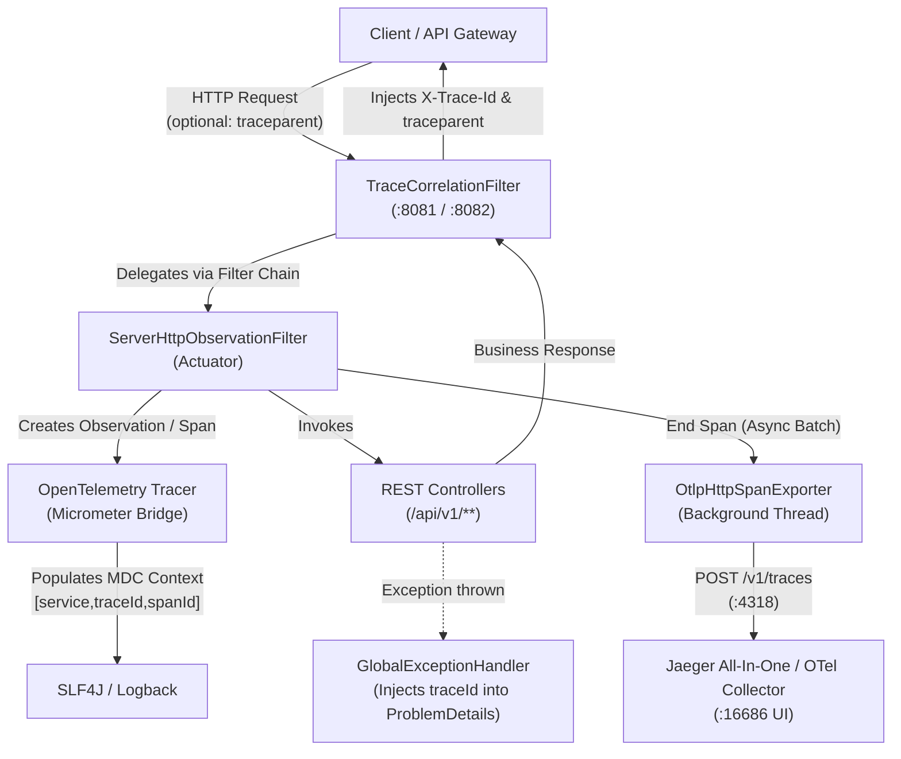
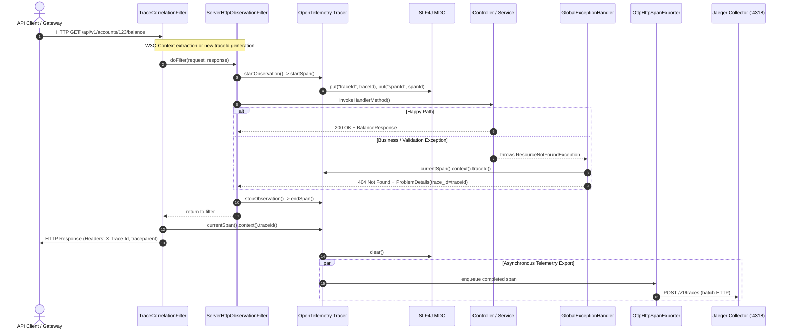

# Design Specification: OpenTelemetry Distributed Tracing

## 1. System Architecture & Telemetry Pipeline

Distributed tracing in the FSE Banking Platform utilizes the native Spring Boot 3 Actuator Observability engine paired with the Micrometer Tracing OpenTelemetry Bridge (`micrometer-tracing-bridge-otel`) and the OpenTelemetry Protocol trace exporter (`opentelemetry-exporter-otlp`).

### Architecture & Dataflow Diagram



### Request Lifecycle Sequence Flow



---

## 2. Component Interfaces & Specifications

### 2.1 TraceCorrelationFilter
A Spring Web Servlet Filter executed for all requests.
- **Order**: Executes within the observation context (e.g. `Ordered.HIGHEST_PRECEDENCE + 5`).
- **Response Headers Added**:
  - `X-Trace-Id`: Current 32-character hexadecimal trace ID.
  - `traceparent`: W3C Trace Context formatted string `00-{traceId}-{spanId}-01`.
- **Request Attributes Added**:
  - `com.fse.banking.traceId`: trace ID string for programmatic consumption by controllers and exception handlers.

### 2.2 GlobalExceptionHandler Trace Enrichment
- The RFC-7807 `ProblemDetails` model is augmented with an optional field:
  `@JsonProperty("trace_id") private String traceId;`
- In `GlobalExceptionHandler`:
  Whenever any exception is caught, the active trace ID is obtained from `io.micrometer.tracing.Tracer` (or fallback to `MDC.get("traceId")`) and assigned to `ProblemDetails.traceId`.

### 2.3 Configuration Properties (`application.properties`)
```properties
# 100% of requests traced
management.tracing.sampling.probability=1.0

# W3C Trace Context propagation
management.tracing.propagation.type=W3C

# MDC Baggage correlation
management.tracing.baggage.correlation.enabled=true

# OTLP HTTP trace exporter endpoint
management.otlp.tracing.endpoint=${OTEL_EXPORTER_OTLP_ENDPOINT:http://localhost:4318/v1/traces}
management.otlp.tracing.transport=http

# MDC logging format
logging.pattern.level=%5p [${spring.application.name:},%X{traceId:-},%X{spanId:-}]
```

### 2.4 Technology Selection

| Layer / Aspect | Choice | Rationale |
| :--- | :--- | :--- |
| Tracing Abstraction | Micrometer Tracing 1.3.x | Native Spring Boot 3 observability model; decoupled from specific exporter formats. |
| Tracing Engine | OpenTelemetry SDK | Industry standard vendor-neutral distributed tracing runtime. |
| Context Standard | W3C Trace Context | Interoperable across API Gateway, microservices, cloud providers, and browser clients. |
| Exporter Protocol | OTLP / HTTP | Direct, non-blocking HTTP span transmission compatible with OpenTelemetry Collector and Jaeger. |
| Local Visualizer | Jaeger All-In-One | Native OTLP receiver (4317/4318) and lightweight developer-friendly UI (16686). |

---

## 3. Correctness Properties & Invariants

1. **Trace ID Determinism & Format**:
   For any incoming request, the generated or propagated `traceId` must be a valid 32-character hexadecimal string `^[0-9a-fA-F]{32}$`.
2. **Context Preservation**:
   If an incoming request includes `traceparent: 00-{T}-{S}-01`, the recorded trace ID in the service, logs, response headers, and error payloads must strictly equal `{T}`.
3. **Response Header Guarantee**:
   For every HTTP request reaching the application (status 2xx, 3xx, 4xx, 5xx), the response must contain `X-Trace-Id` equal to the trace ID.
4. **Error Payload Correlation**:
   For any error returning RFC-7807 `ProblemDetails`, `problemDetails.getTraceId()` must match the active `X-Trace-Id`.

---

## 4. Traceability Matrix

| Requirement | Implementation Component | Verification Method |
| :--- | :--- | :--- |
| `REQ-OTEL-1.1` | `micrometer-tracing-bridge-otel`, Actuator Observation | Unit & MVC integration tests |
| `REQ-OTEL-1.2` | `application.properties` (`sampling.probability=1.0`) | Configuration verification & test assertion |
| `REQ-OTEL-1.3` | `OpenTelemetry` Tracer ID Generator | Trace ID format regex test |
| `REQ-OTEL-1.4` | `W3C TraceContext` Propagator | Test with simulated incoming `traceparent` |
| `REQ-OTEL-1.5` | `opentelemetry-exporter-otlp` | OTLP exporter dependency and configuration |
| `REQ-OTEL-1.6` | `BatchSpanProcessor` async daemon queue | Non-blocking offline test |
| `REQ-OTEL-2.1` | `TraceCorrelationFilter` | Assert `X-Trace-Id` header on all responses |
| `REQ-OTEL-2.2` | `TraceCorrelationFilter` | Assert `traceparent` header format |
| `REQ-OTEL-2.3` | `TraceCorrelationFilter` | Error path HTTP 400/401/404/500 tests |
| `REQ-OTEL-3.1` | `ProblemDetails.java` (`traceId` field) | JSON serialization test |
| `REQ-OTEL-3.2` | `GlobalExceptionHandler.java` | Exception translation tests checking `trace_id` |
| `REQ-OTEL-4.1` | `application.properties` (`logging.pattern.level`) | Log pattern verification |
| `REQ-OTEL-4.2` | SLF4J MDC Tracing Handler | Test logging during request processing |
| `REQ-OTEL-5.1` | `infrastructure/docker-compose.yml` (Jaeger) | Docker Compose manifest validation |
